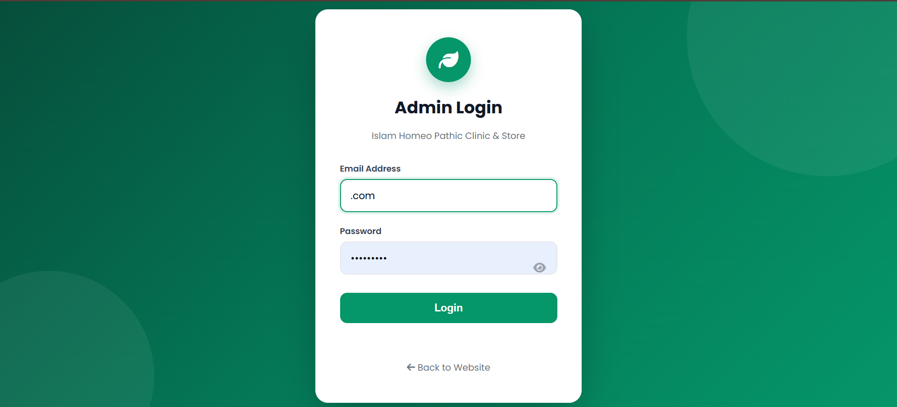
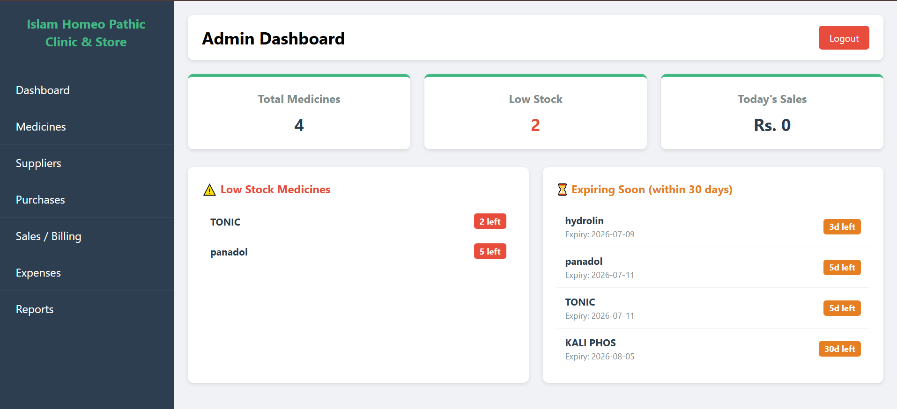
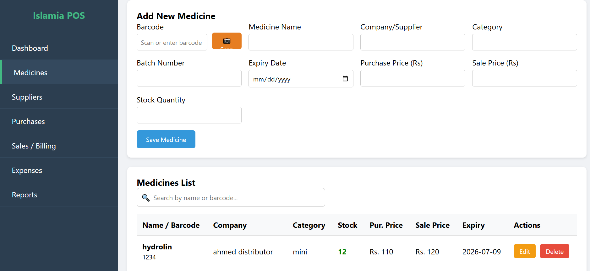
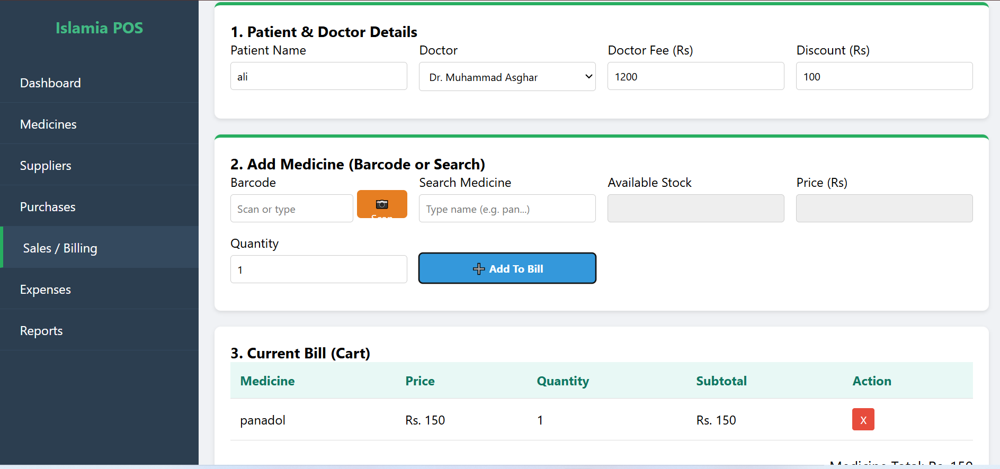
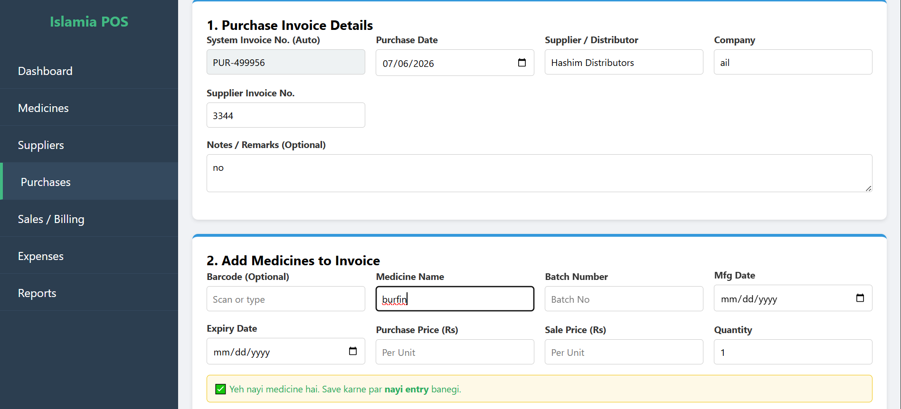
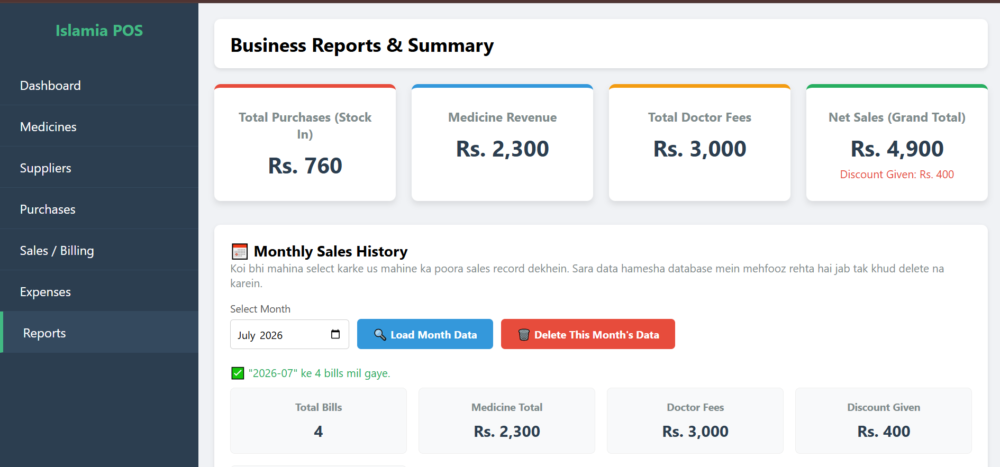
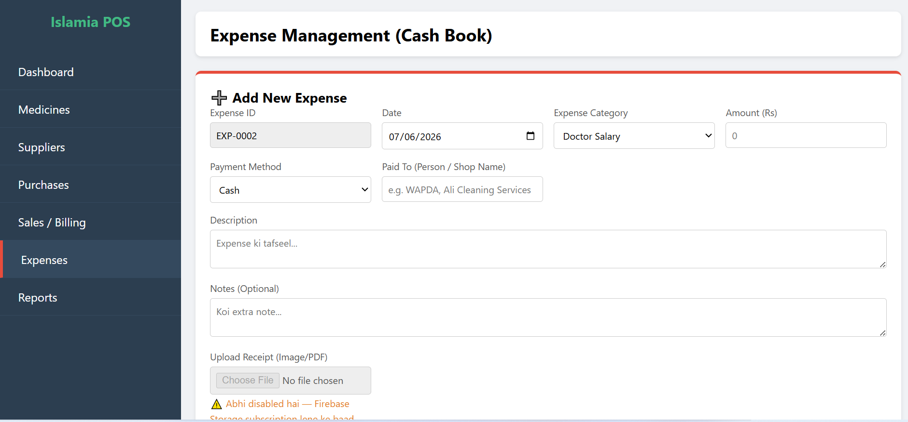
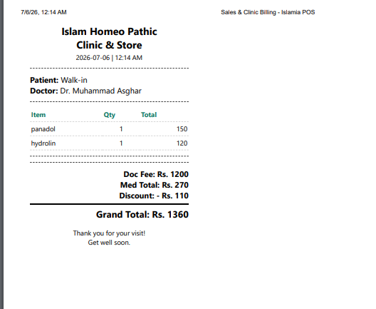

# 🏥 Islamia Pharmacy POS & Inventory Management System

A modern Pharmacy POS & Inventory Management System built with HTML, CSS, JavaScript and Firebase.

## ✨ Features

- 💊 Medicine Management
- 🛒 Sales Management
- 📦 Purchase Management
- 👥 Supplier Management
- 💰 Expense Tracking
- 📊 Reports & Analytics
- 🔐 Secure Admin Login
- ☁️ Firebase Integration
- 📱 Responsive Design

## 🛠️ Technologies Used

- HTML5
- CSS3
- JavaScript (ES6)
- Firebase

## 📂 Project Structure

```
├── assets/
├── css/
├── js/
├── pages/
├── index.html
├── login.html
└── dashboard.html
```

## 🚀 Getting Started

1. Clone the repository
2. Open the project in Visual Studio Code
3. Configure Firebase
4. Run the project

## 👨‍💻 Developer

**Muhammad Usman**

GitHub: https://github.com/usman3015540

---
⭐ If you like this project, don't forget to star the repository.
## 📸 Project Screenshots

### 🏠 Home Page


### 🔐 Login


### 📊 Dashboard


### 💊 Medicine Management


### 🛒 Sales


### 📦 Purchases


### 📈 Reports


### 💰 Expense Management


### 🧾 Bill Generation
